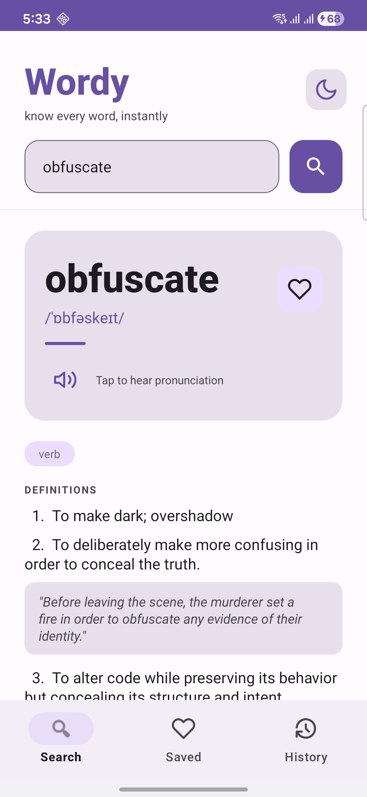
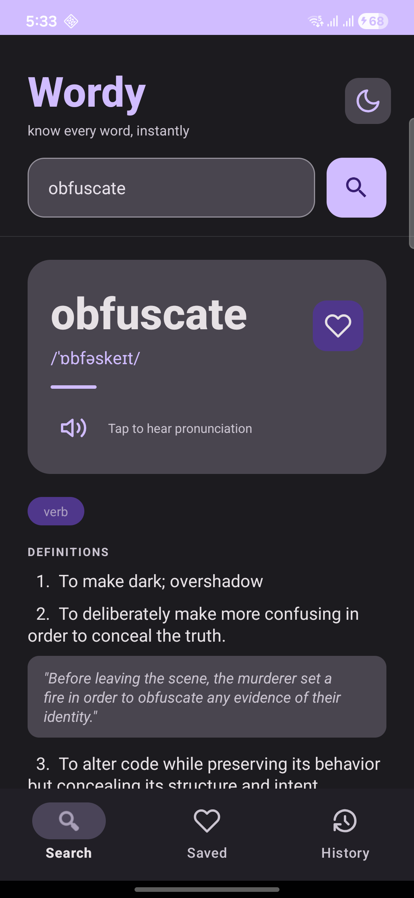
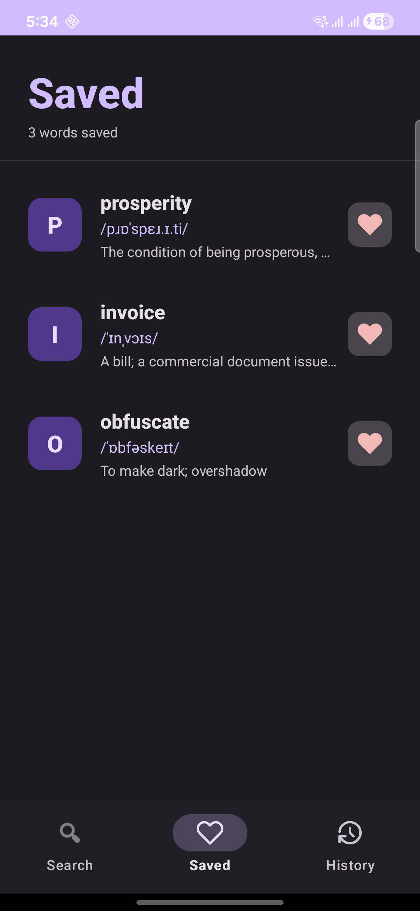
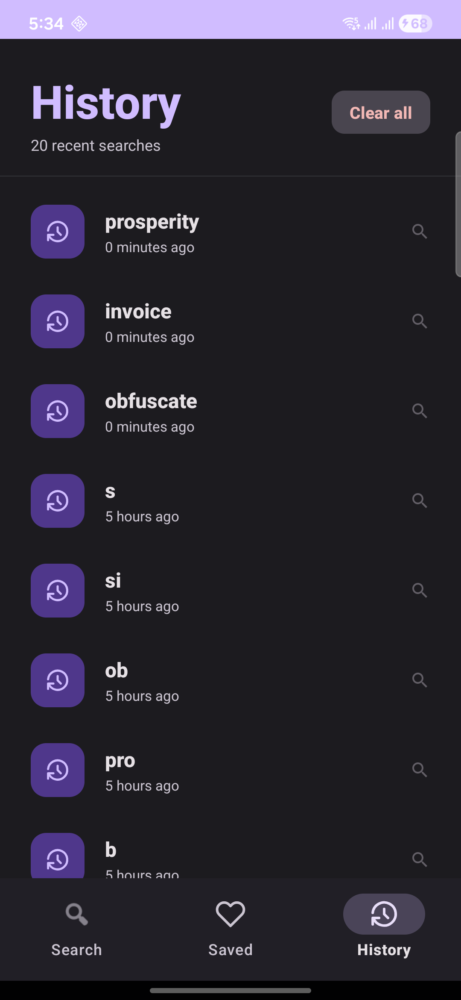

# Wordy 📖
### Know every word, instantly

A production-ready Android dictionary app built with modern Android development best practices. Demonstrates clean architecture, dependency injection, local database, REST API integration, and polished Material 3 UI.

---

## Screenshots

<p align="center">
  
  
  
  
</p>

## Features

- 🔍 **Search any English word** with real-time debounce (no API spam)
- 🔊 **Text-to-speech pronunciation** using Android TTS engine
- 📖 **Full word details** — definitions, examples, part of speech, phonetics
- 🔗 **Synonyms & antonyms** as clickable chips — tap to search instantly
- ❤️ **Save favourite words** stored locally with Room database
- 🕐 **Search history** — last 20 searches with relative timestamps
- 🌙 **Dark / light mode** toggle with persistent preference
- 💀 **Shimmer loading** effect while fetching data
- ⚠️ **Error states** — word not found, no internet, unexpected errors

---

## Tech Stack

| Layer | Technology |
|---|---|
| Language | Kotlin |
| Architecture | MVVM + Clean Architecture |
| Dependency Injection | Hilt |
| Networking | Retrofit + OkHttp + Gson |
| Local Database | Room |
| Async | Coroutines + Flow |
| State Management | ViewModel + LiveData |
| Navigation | Navigation Component + Safe Args |
| UI | Material 3 + ViewBinding |
| Loading Effect | Facebook Shimmer |
| Speech | Android TextToSpeech |

---

## Architecture

The app follows **Clean Architecture** with 3 layers:

```
presentation/       → Fragments, ViewModels, Adapters
domain/             → Repository interfaces, Entities
data/               → Repository implementations, API, Room DB
core/               → Network client, DI modules, Utilities
```

---

## API

This app uses the free [Dictionary API](https://dictionaryapi.dev/) — no API key required.

```
GET https://api.dictionaryapi.dev/api/v2/entries/en/{word}
```

---

## Project Structure

```
app/src/main/java/com/hemlata/wordy/
├── core/
│   ├── network/          RetrofitClient, NetworkModule, RepositoryModule, DatabaseModule
│   └── utils/            Resource.kt (sealed class), PreferenceManager
├── data/
│   ├── local/            AppDatabase, WordDao, WordEntity, HistoryEntity
│   ├── model/            WordResponse, Meaning, Definition, Phonetic
│   ├── remote/           DictionaryApi
│   └── repository/       DictionaryRepositoryImpl
├── domain/
│   └── repository/       DictionaryRepository (interface)
├── presentation/
│   ├── search/           SearchFragment, SearchViewModel
│   ├── favourites/       FavouritesFragment, FavouritesViewModel, WordAdapter
│   └── history/          HistoryFragment, HistoryViewModel, HistoryAdapter
└── WordyApp.kt
```

---

## Getting Started

1. Clone the repository
```bash
git clone https://github.com/hemlataverma-dev/wordy-android.git
```

2. Open in Android Studio

3. Build and run on emulator or device (minimum SDK 24)

No API key needed — works out of the box.

---

## Key Implementation Highlights

**Sealed Resource class** — wraps every API call into Loading / Success / Error states, ensuring the UI always has a clear state to react to.

**Hilt dependency injection** — all dependencies are injected via constructor injection across Repository, ViewModel, and Fragment layers.

**Debounced search** — uses Kotlin Coroutines `delay()` to cancel and restart the API call on every keystroke, preventing unnecessary network requests.

**Room + LiveData** — favourites and history are observed as LiveData, so the UI updates automatically whenever the database changes.

**Clean Architecture** — the domain layer has zero knowledge of Android or data layer implementation details. The repository interface is the only contract.

---

## What I Learned

- Implementing Hilt dependency injection end-to-end in a multi-layer architecture
- Using Room with LiveData for reactive local data
- Handling multiple API response states cleanly with sealed classes
- Building dynamic UI programmatically (meanings, chips) from API response
- Managing TextToSpeech lifecycle correctly to avoid memory leaks

---

## Author

**Hemlata Verma**
Senior Mobile Application Developer — 6+ years Android & Flutter experience

[](https://linkedin.com/in/YOUR-LINKEDIN)
[](mailto:vra.hemlata@gmail.com)

---

## License

```
MIT License — free to use for learning and portfolio purposes
```
